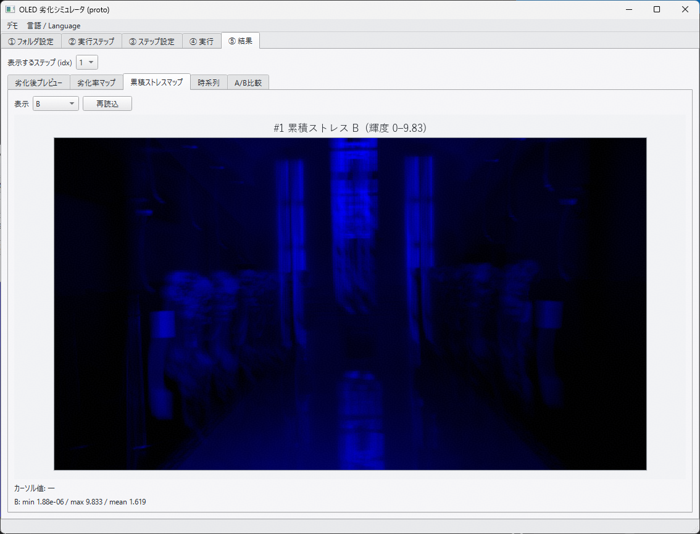
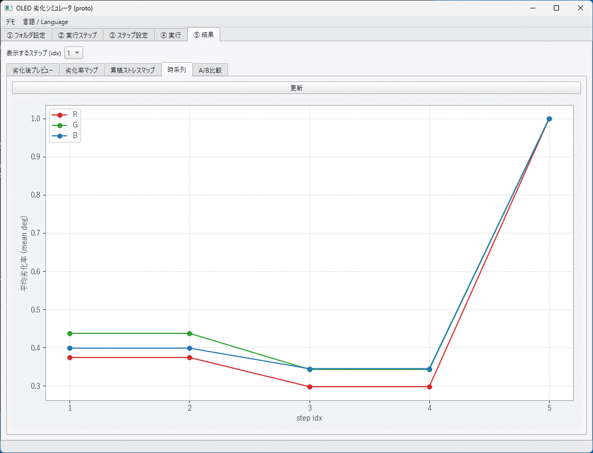
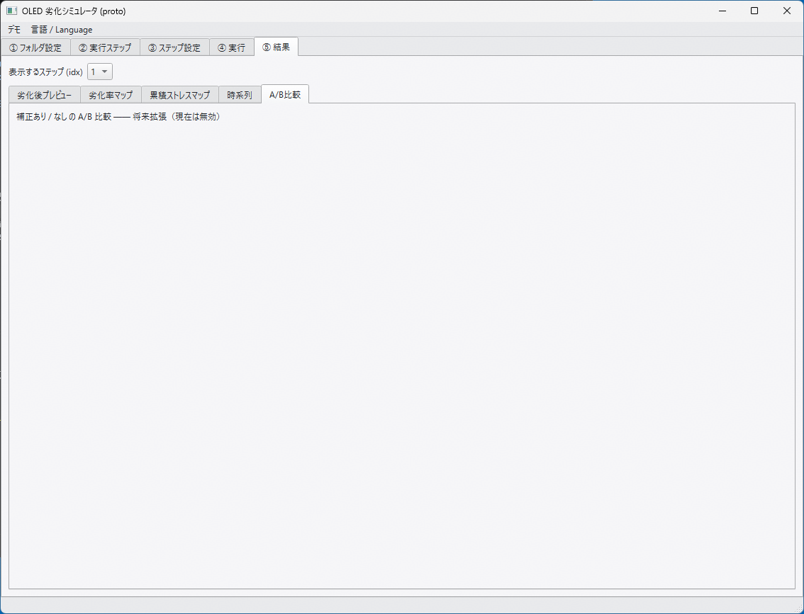
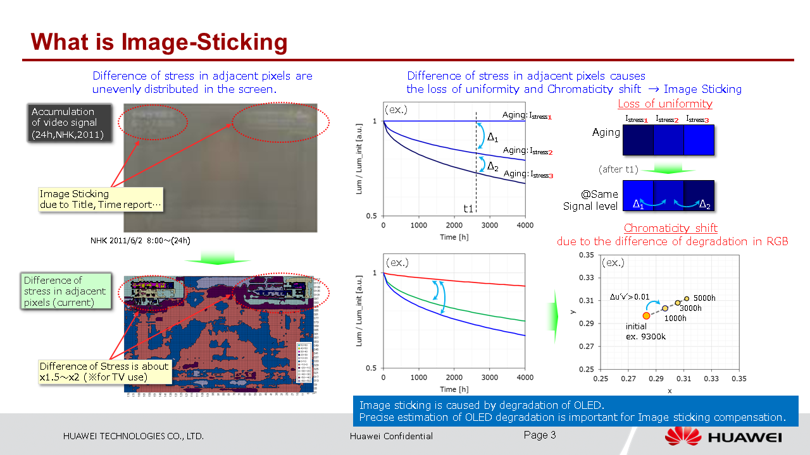

## 劣化シミュレータ GUI開発 - 進捗報告

**報告日**: 26/9/3
**報告者**: 堀部
**対象期間**: 2026/9/1〜10/30

---

## 1. プロジェクト概要

| 項目 | 内容 |
|---|---|
| 目的 | OLED焼き付き（Burn-in）劣化シミュレータをGUI化し、DBI（焼き付き補正）/ BIP（焼き付き予防）のIP設計の参考データ収集に使えるツールとして完成させる |
| 期限 | 26/10/30 完成予定 |
| 役割 | GUI・ワークフロー・可視化・入出力管理 |
| 方針 | 劣化計算アルゴリズム部を差し替え可能な形に分離し、アルゴリズム更新の影響をGUI側に波及させない |

---

## 2. 今週の成果 — アプリ画面レイアウト

タブ構成として画面をコンパクトにした。主要機能毎にタブを編成した。

### 構成（Python GUI / 5タブ）

| タブ | 内容 |
|---|---|
| フォルダ設定 | 入力画像／ヒートマップ／BC設定／モデルパラメータ／Sim条件／出力の各フォルダをファイルダイアログで変更。既定値は既存コード構成 |
| 実行ステップ | 処理ステップの一覧・追加・複製・削除・並べ替え |
| ステップ設定 | 入力画像・ヒートマップ・前回Aging結果のプレビュー、初期ストレス（なし／前ステップ継承／ファイル指定）、モデルパラメータ表（CSV読込/保存）、Sim条件 |
| 実行 | 全ステップ／選択ステップ実行、中断。全体進捗＋フレーム進捗＋処理中フレーム表示＋経過時間 |
| 結果 | 劣化後映像／画像プレビュー、劣化率マップ（各チャネル色の輝度表示・RGB合成）、累積ストレスマップ |

###### メモ

- `eval_exec.bat` 相当の4ステップ（動画Aging → 静止画PQ評価 → 動画Aging継続 → 静止画PQ評価）を参考に実行ステップを構成、`dbi_output/` に結果を保存、
- Aging の途中再開に対応（前ステップの累積ストレス `stat_*.csv` を引き継ぐように構成）
- 劣化計算アルゴリズムのコードは import して利用
- 日本語 / 英語 切替は、自分用でリリースは英語だけ

### 機能毎の画面構成
##### 1. フォルダ設定
画像種別毎に設定でき、参照を押すとファイルマネージャが開き、それを選択する。

図1. フォルダ設定タブ

##### 2. 実行ステップ
Aging、PQ評価などの実行種類を設定する。登録順に実行される。

図2. 実行ステップタブ

##### 3. ステップ設定
各実行ステップ毎に画像ファイル指定、パラメータ設定などを行う。

図3. ステップ設定タブ

##### 4. 実行
各実行ステップ毎、又は全ステップを実行する。インジケータで計算がどこまで進んでいるかを表示する。計算中は時間がかかることも考慮して適当な間隔で中間の画像を表示する。

図4. 実行タブ（進捗・途中経過）

##### 5. 結果

###### 5-1. 劣化後プレビュー
Aging結果画像のプレビューを表示する。動画の時は下のインジケータで別のフレームも見れる。

図5-1. 結果タブ／劣化後プレビュー

###### 5-2. 劣化率マップ
Degradationマップを色別に表示する。R/G/B毎に色付けしていて色が濃いほど値が大きいことを示す。1_deg_b.csvなどのデータ表示。

図5-2. 結果タブ／劣化率マップ

###### 5-3. 累積ストレスマップ
累積ストレスマップを色別に画像表示する。R/G/B毎に色付けしていて色が濃いほど値が大きいことを示す。1_stat_b.csvなどのデータ表示。

図5-3. 結果タブ／累積ストレスマップ

###### 5-4. 時系列
実行ステップの劣化率（1_deg_b/g/r.csvなどの数値を平均化）を平均化したものをグラフ表示する。

図5-4. 結果タブ／時系列

###### 5-5. AB比較
将来対応で、補正あり／なしの画像を表示して比較する。

図5-5. 結果タブ／AB比較

---

## 3. レビュー観点

1. **画面構成・タブ分割・操作フロー**の妥当性
2. **劣化率マップの表示方法**
- 各チャネル色の輝度で表現してみたがこれで良いか？　今は、劣化度合いが大きいときに色が濃くなる表示だが、グレイ表示の方が良いか？
- RGB合成は不要か？　
3. **実行ステップの配置**
ステップ連鎖（Aging → PQ評価）はこれで良いか？

---

## 4. 判明した課題

| # | 課題 | 対応、要望、提案など |
|---|---|---|
| 1 | 出力マップが CSV で肥大（480×270 で 1ファイル約3MB、RGB×2種で6ファイル/ステップ） | CSVデータを画像データ（RAW、TIFF）にしたらどうか？ RAWデータのとき、スマホサイズ1320x2848で6.3MB（CSVは94MB） |
| 2 | 処理時間が大 | CPUのマルチコアで並列したいが、画像データを分割して実行して大丈夫か？ |

---

## 5. 今後の計画（10月末まで）

| 時期 | フェーズ | 内容 | 
|---|---|---|
| 次週 | プロトタイプレビュー | レビュー結果反映、シミュレータアプリのUI（外側）だけの実装完了、動作レビュー |
| 9月下旬 | 劣化計算アルゴリズムとの結合した形で実装完了 | アプリをEXE形式で配布して動作チェック依頼 |
| 10月上旬 | バグ修正 | チェックしてもらった結果の不具合、機能追加などの修正を反映 |
| 10月中旬 | 大解像度・大容量データ対応 | ① アルゴリズムコアのタイル並列実行（高速化） ② 出力マップ（劣化率・累積ストレス）を CSV → 画像フォーマット（RAW / TIFF 等）へ変更し保存容量を縮小 ③ 画像化したマップとパネル画像を対比し、任意領域の数値を確認するビューア |
| 10月下旬 | 修正、パッケージング準備、リリース ||

## 参考
#### **AMOLED_Image_sticking_prevention_compensation_v01**
###### slide 3

###### slide 4

###### slide 5

###### slide 6

###### slide 7

#### **Platform Concept for DBI & BIP development**
###### slide 2

###### slide 3

