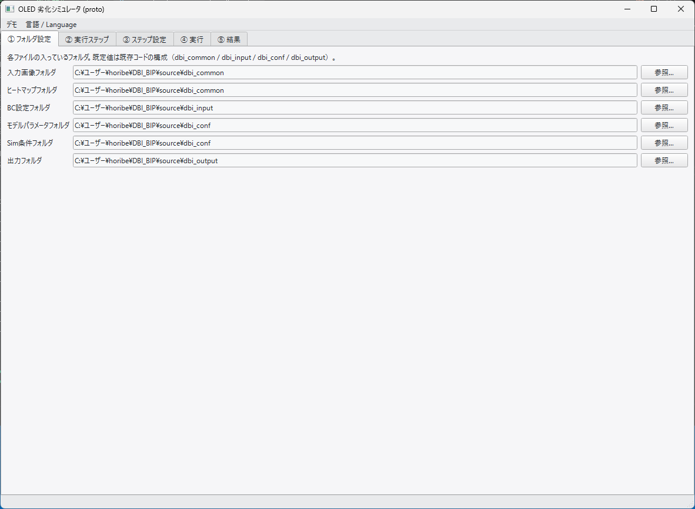
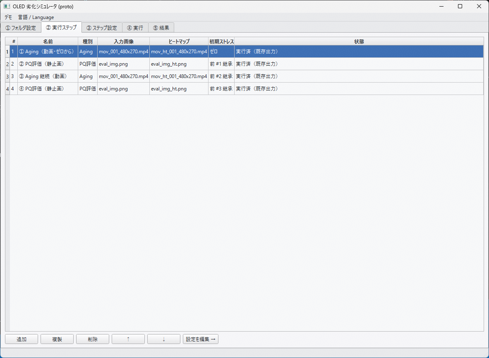
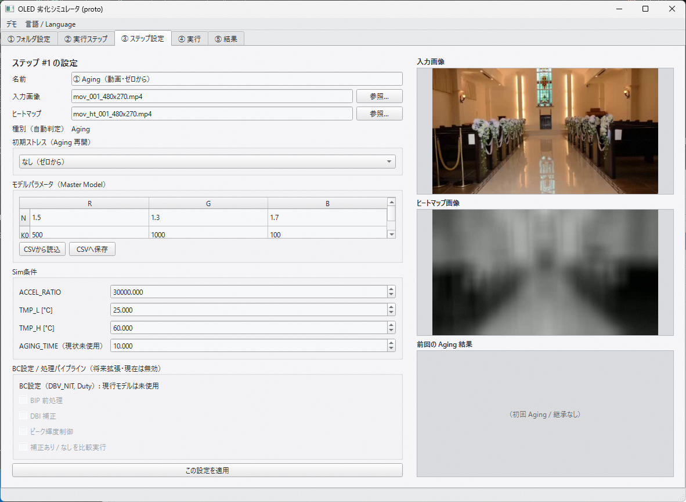
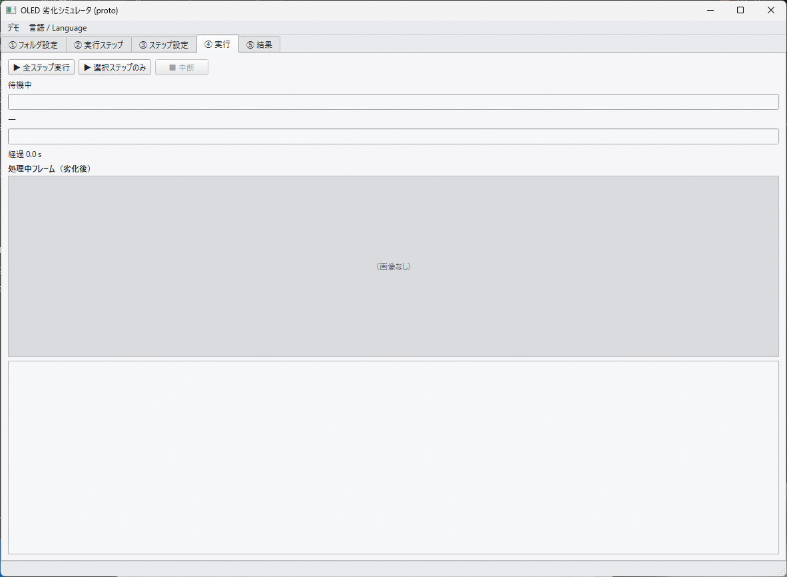
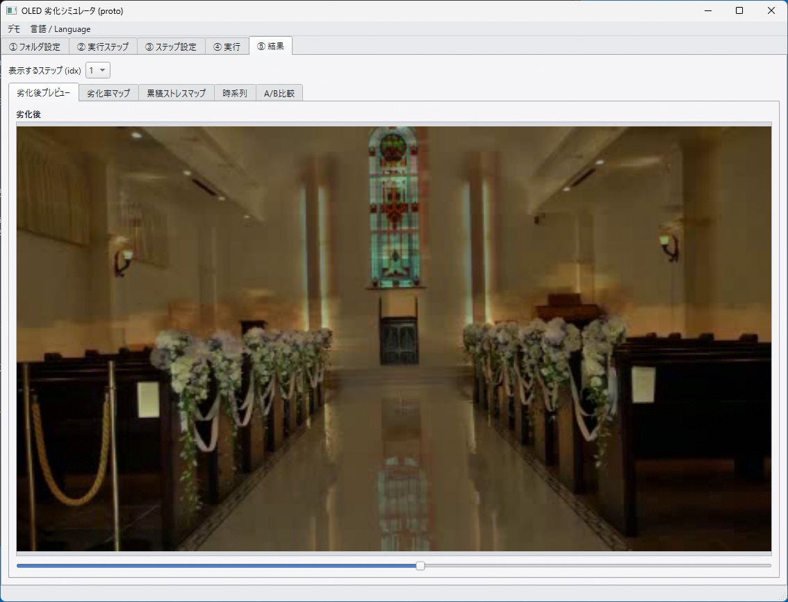
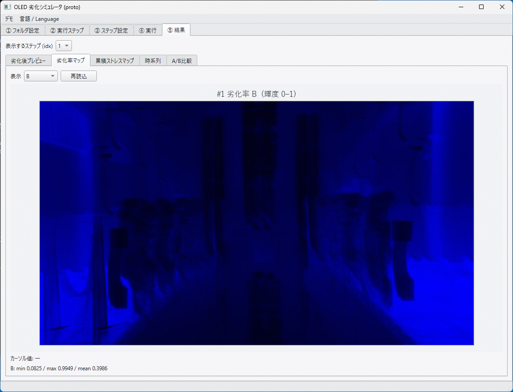

<!-- _class: lead -->
<!-- _paginate: false -->
<!-- _header: '' -->

# 劣化シミュレータ GUI開発
## 進捗報告 02 ＋ アプリ紹介・仕様確認

**報告日** 2026/9/10　**報告者** 堀部
**対象期間** 2026/9/3 〜 10/30　**本日** 進捗報告・EXE配布・GUIデモ

---

<!-- _class: tight -->

## 0. 本日のアジェンダ

| # | 内容 | 資料 |
|---|---|---|
| 1 | 進捗サマリ（9/3レビュー以降） | 本資料 §1 |
| 2 | 仕様確認 — 9/3議事録の指摘 → 実装状況の突き合わせ | §2（`260903_meeting_review.md` / `GUI仕様.md`） |
| 3 | GUI操作デモ（5タブ＋停止・再開） | §3（実機で実演） |
| 4 | EXE配布物の説明・評価のお願い | §4 |
| 5 | 確認したい事項・次フェーズ（コア統合）の段取り | §5・§6 |

- 本日は**GUIとワークフローの仕様確認**が主目的。劣化モデルの数式・実装の詳細は対象外（フェーズF）。

---

<!-- _class: tight -->

## 1. 進捗サマリ

| 区分 | 状態 |
|---|---|
| プロトタイプ（`prototype/`）UX検証 | 完了・**9/3 レビュー実施済** |
| 本番GUI `bisim/` フェーズA〜E | **実装完了・commit 済** |
| ├ A: データモデル・命名規則 | ✅ |
| ├ B: 劣化エンジン分離・ログ | ✅ |
| ├ C: UIシェル・5タブ | ✅ |
| ├ D: 中断・停止・再開 | ✅ |
| └ E: EXEパッケージング（PyInstaller） | ✅ 手順書＋ビルドスクリプト |
| 別PC（EXE）での評価チェック | 担当者実施完了 → 指摘5件を反映（フェーズ1〜3、commit 済） |
| 自動テスト | `python -m bisim.selftest` **56/56 pass** |
| 残 | **フェーズF：IP設計者コアの統合・原理確認・社内試用**（10月） |

---

<!-- _class: tight -->

## 1. 進捗サマリ — スケジュール

| 時期 | フェーズ | 内容 | 状態 |
|---|---|---|---|
| 9月上旬 | プロトタイプレビュー | 9/3 レビュー、指摘反映、UI（外側）実装完了 | ✅ |
| 9月中〜下旬 | 本番GUI実装・EXE化 | フェーズA〜E、EXE配布・別PC評価 | ✅ |
| **9/10（本日）** | **中間報告・配布** | **EXE配布、仕様確認、デモ** | ← |
| 10月初 | アルゴリズム結合 | IP設計者コア受領 → `DegradationModel` I/F で差し替え → 結合 | 予定 |
| 10月中旬 | 原理確認・バグ修正 | 統合版の原理確認、使い込みでの残バグ修正 | 予定 |
| 10月下旬 | リリース準備 | 社内試用反映、パッケージング、リリース | 予定 |

- 大解像度・大容量対応（マップ画像化＋ビューア、CPU並列）は**完成後のテーマ**（§5）。

---

<!-- _class: lead -->

# 2. 仕様確認
## 9/3 議事録の指摘 → 実装状況

`docs/progress/260903_meeting_review.md`（議事録）
`docs/progress/260903_review_result_BI-sim.md`（レビュー指摘）
`docs/GUI仕様.md`（確定仕様）

---

<!-- _class: tight -->

## 2-1. 画面構成・操作フロー

| 議事録の指摘 | 実装状況 |
|---|---|
| 劣化計算アルゴは I/F が変わらない限り差し替え可能な構成に（C） | ✅ `DegradationModel` I/F で分離。現状は暫定コア（`source/`）をラップ、10月に本コアへ差し替え |
| ②実行ステップのファイル指定は**不可**、③ステップ設定で行う。②は順序操作 | ✅ ②は追加/複製/削除/並べ替えのみ。ファイルは③で指定 |
| ②→③の順序はこのまま（②で空行 → ③で設定） | ✅ この順序で実装 |
| 実行するステップの選択は**④実行タブ**で行う | ✅ ④のコンボボックスで単一ステップを選択して実行 |
| 変更したレシピは保存できる | ✅ レシピ単体を `*.recipe.json` で保存／読込。シーケンスは `*.seq.json` |

---

<!-- _class: tight -->

## 2-2. ファイル命名規則・ログ

| 議事録の指摘 | 実装状況 |
|---|---|
| Input と Output でファイル名規則を変える（レシピ間で入力共有があるため） | ✅ 仕様4章どおり |
| Input: `レシピ名_種別[_色].拡張子` | ✅ 例 `aging01_movie.mp4`, `pq01_stat_r.csv` |
| Output: `シーケンス名_番号_レシピ名_種別[_色].拡張子` | ✅ 例 `SEQ-A_01_aging01_deg_r.csv` |
| シーケンス名・番号(NN)はアプリ側が持つ（Config に NN は保存しない） | ✅ NN はリスト位置から算出 |
| ログ出力（何を実行したかを簡潔に：入出力ファイル名・動作・パラメータ変更） | ✅ 画面ログ欄 ＋ `_log_BISim/BISim_YYMMDD.log`（日付ローテーション・容量上限） |

---

<!-- _class: tight -->

## 2-3. 中断・停止・再開

| 議事録の指摘 | 実装状況 |
|---|---|
| 中断・再開＝ファイル出力なし、アプリが状態を保持 | ✅ メモリ保持のみ。計算時間も中断中はフリーズ |
| 停止＝そこまでの結果をファイル出力。保存要否をユーザーに提示 | ✅ 停止 → 保存確認ダイアログ |
| 停止段階から後で再開できる | ✅ 「▶↻ 停止位置から再開」。部分動画を連結し**連続動画**として出力 |
| （評価での追加要望）停止のたびに日時ファイルが増える／再開手順が2重 | ✅ **リデザイン**：停止情報を**シーケンスJSONに内包**（`stops`）。実データは `出力/_stops/<…>/` に最新1件のみ。再開は「シーケンスを開く」→ ボタン、の1手順 |

---

<!-- _class: tight -->

## 2-4. 結果表示（⑤タブ）

| 議事録の指摘 | 実装状況 |
|---|---|
| 劣化率マップのラベルを **「1/劣化率」**（明るい＝劣化していない） | ✅ 「1/劣化率 / inverse degradation」に変更。累積側も「累積時間 / accumulated time」 |
| 劣化率マップ・累積ストレスマップに **RGB合成画像**が必要 | ✅ R / G / B / RGB合成 の4表示 |
| 累積時間マップは**面内の相対ばらつき**を表現 | ✅ 面内最大で正規化して表示 |
| 時系列タブは継続検討 → 白紙のグラフだけ表示 | ✅ 軸のみ・中身なし |
| W の劣化率マップもある（議事録） | ⚠ **その後の命名規則確定で W は作らない方針に変更**（§5 で確認） |

---

<!-- _class: tight -->

## 2-5. Config・その他

| 議事録／レビューの指摘 | 実装状況 |
|---|---|
| Configファイル保存（シーケンス＋各種CSVファイル名）、シーケンス名として保存 | ✅ `sequence_name` ＋ `folders` ＋ `recipes[]` を JSON 保存（日本語もそのまま） |
| アプリメニューに「開く」があり Load/Save できる | ✅ ファイルメニュー：開く / 保存 / 名前を付けて保存 / レシピ読込 / レシピ保存 |
| 出力マップの CSV 肥大 → 画像データ（RAW/TIFF）で扱う方針で合意 | 📋 **当面は CSV**。画像フォーマット化＋専用ビューアは完成後のテーマ |
| CPU 並列のための画像分割は問題なし（1画素単位の計算） | 📋 方式は確定。実装は完成後のテーマ |
| リリースは英語UI、日本語は開発用に残す | ✅ JP/EN 切替。既定英語 |

---

<!-- _class: lead -->

# 3. GUI操作デモ
## 5タブを順に実演

（以下は実機デモの進行メモ。画面イメージはプロトタイプ版）

---

## デモ① フォルダ設定

- 入力画像 / ヒートマップ / BC設定 / モデル / Sim / 出力 の **6フォルダ**
- 各行「参照…」でフォルダダイアログ。既定値は `source/` の構成
- ③でファイルを選ぶと親フォルダがここへ自動反映
- **変更したフォルダは次回起動時も保持**（評価指摘の反映）

---

## デモ② 実行ステップ

- レシピ（ステップ）の一覧：#／NN／レシピ名／種別／入力／ヒートマップ／初期ストレス／状態
- **追加 / 複製 / 削除 / 並べ替え（↑↓）** — NN は自動で振り直し
- このタブではファイル指定はしない（③へ）
- 「シーケンス名・レシピ名は半角英数字推奨」の注意書きを常時表示

---

## デモ③ ステップ設定

- レシピ名／入力画像（参照）／ヒートマップ（参照）。拡張子で Aging / PQ評価 を自動判定
- プレビュー3面：入力画像 / ヒートマップ / 前回Aging結果
- 初期ストレス：なし / 前ステップ継承 / ファイル指定
- モデルパラメータ表（N/K0/Q/B0/A × RGB）＋ **CSV 読込／保存**
- Sim条件（ACCEL_RATIO / TMP_L / TMP_H / AGING_TIME）＋ **CSV 読込／保存**
  - CSV は CLI版 `degparam_mm.csv` / `simconf.csv` と**同書式**

---

## デモ④ 実行（1）— 通常実行

- **全ステップ実行** ／ **実行するステップを選択**（このタブのコンボで単一選択）
- 進捗：全体（step i/N）＋ フレーム（j/M）＋ 処理中フレームのライブ表示
- 時間：**計算時間**（実PC時間）＋ **Aging時間（加速込み）**＝(フレーム数÷fps)×ACCEL_RATIO
- 画面ログ欄に入出力ファイル名・動作を逐次表示

---

<!-- _class: tight -->

## デモ④ 実行（2）— 中断・停止・再開

| 操作 | 動作 |
|---|---|
| **中断 → 再開** | 状態はメモリ保持、**ファイル出力なし**、計算時間もフリーズ。同一起動中に続行 |
| **停止 → 「保存する」** | `出力/_stops/<シーケンス名_NN_レシピ名>/` に `stat_*` `deg_*` `movie.mp4` を出力（**日時なし・最新1件**）。同時に**シーケンスJSONへ停止状態を内包・自動保存** |
| **停止 → 「保存しない」** | 破棄して終了 |
| **▶↻ 停止位置から再開** | 続きのフレームから実行、先頭に途中動画を連結して**連続動画**を出力。完了すると停止状態は自動で片付け |
| アプリ再起動後 | 「シーケンスを開く」→ 対象ステップ選択 → 同じボタンで再開（別ファイルを開く手間なし） |

---

## デモ⑤ 結果（1）— プレビュー / 1劣化率マップ

- 表示する idx（NN）を選択
- **劣化後プレビュー**：画像／動画（動画はフレームスライダ）
- **1/劣化率マップ**（`_deg_{r,g,b}.csv`）：R / G / B / **RGB合成**
  - 各チャネル色の輝度で表示、**明るい＝劣化していない**
  - カーソル位置の数値を表示

---

## デモ⑤ 結果（2）— 累積時間マップ / 時系列 / A/B

- **累積時間マップ**（`_stat_{r,g,b}.csv`）：R / G / B / RGB合成。**面内最大で正規化**
- **時系列**：白紙の軸のみ（アルゴリズム担当者間で継続検討）
- **A/B比較**：将来枠（無効表示）

---

<!-- _class: tight -->

## デモ⑥ メニュー・ログ・ファイル

- ファイルメニュー：シーケンス 開く／保存／名前を付けて保存、レシピ 読込／保存
  - **保存時はファイル名をシーケンス名に一致させる**（評価指摘の反映）
- 言語メニュー：日本語 / English 切替（設定は保持）
- ログファイル：アプリ直下 `_log_BISim/BISim_YYMMDD.log`
- 出力：`出力フォルダ/` に `シーケンス名_NN_レシピ名_種別[_色].拡張子`
  - 停止時のみ `出力フォルダ/_stops/…/` にチェックポイント

---

<!-- _class: lead -->

# 4. EXE配布物

---

<!-- _class: tight -->

## 4. 配布物の内容と使い方

| 項目 | 内容 |
|---|---|
| 配布ファイル | `BI-sim_YYMMDD.zip`（PyInstaller onedir 一式を zip。展開後は数百MB／PySide6・OpenCV 等を同梱。※実サイズは配布時に記入） |
| 使い方 | 任意フォルダに展開 → `BI-sim.exe` を実行。**Python 環境は不要** |
| 同梱物 | 本番GUI一式 ＋ 暫定劣化コア（`_internal/source/`）＋ 既定の入力サンプル |
| 初回起動 | SmartScreen が出たら「詳細情報」→「実行」 |
| 置き場所の注意 | できれば**半角パス**に展開（例 `C:\Tools\BI-sim\`）。日本語パスは一部で不具合の恐れ |
| 設定・ログ | 実行ファイルの隣に `bisim_app.json` / `_log_BISim/` / 既定 `bisim_output/` が作られる |

---

<!-- _class: tight -->

## 4. 評価のお願い

- 評価用チェックシート：`docs/progress/260907_評価チェックシート_checked.md`
  - 前回分（A〜L）＋ **今回の評価反映後の再評価チェック（再1〜再6）** を追記済み
  - 判定欄に `OK` / `NG` / `保留`、気づきは評価メモ欄へ
- 特に見てほしい点
  - モデル／Sim パラメータ CSV が **CLI版と同書式**か（IP設計者が CLI で独立にコアを回せること）
  - 停止・再開の一連の流れ（`_stops/` とシーケンスJSONの `stops`）
  - レシピの追加・削除・再開を繰り返したときの残バグ
- コアの `DegradationModel` I/F（`update()` ＋ `deg_maps()`）は別途すり合わせ

---

<!-- _class: lead -->

# 5. 確認したい事項

---

<!-- _class: tight -->

## 5. この場で確認したいこと

| # | 論点 | こちらの案 |
|---|---|---|
| 1 | **W の劣化率／累積マップ** | 命名規則の確定に合わせ **W は作らない**（色トークンは r/g/b のみ、RGB合成表示で代替）。9/3議事録の「Wもある」から変更。→ 合意可能か |
| 2 | **停止情報のシーケンスJSON内包** | 別ファイル(`_resume_*.json`)をやめ、シーケンスJSONの `stops` に内包。実体は `_stops/` に最新1件。→ この方針で確定してよいか |
| 3 | **時系列タブの中身** | 現状は白紙。表示する統計量（平均劣化率の推移 等）をアルゴリズム担当間で決めてほしい |
| 4 | **静止画(PQ評価)の表示時間** | 現状 Aging時間への寄与ゼロ。表示時間を持たせるか（`GUI仕様.md` 9章 未確定#1） |
| 5 | **マップ画像化＋ビューア／CPU並列** | 完成後（10月下旬以降 or リリース後）のテーマという整理でよいか |

---

<!-- _class: lead -->

# 6. 次フェーズ（F：コア統合）

---

<!-- _class: tight -->

## 6. コア統合の段取り

| ステップ | 内容 | 時期 |
|---|---|---|
| コア受領 | IP設計者から劣化アルゴリズムコアを受領 | 10月初 |
| 差し替え | `DegradationModel` I/F 実装を新コアに差し替え（GUI側は無改修が目標） | 10月初〜中 |
| 結合・原理確認 | 統合版で既知の入力に対する挙動確認（原理確認） | 10月中 |
| 社内試用 | 担当者・IP設計者が使い込み、残バグ・要望を洗い出し | 10月中〜下 |
| リリース準備 | 修正反映、パッケージング、リリース | 10月下 |

- **I/F の前提**：1フレーム更新（`dt`, 入力画像, ヒートマップ, 累積ストレス, モデル/Sim パラメータ）＋ 劣化率マップ算出。
  モデル/Sim パラメータは CSV（CLI版と同書式）で受け渡し。

---

<!-- _class: lead -->

## まとめ

- 本番GUI `bisim/` は**フェーズA〜E完了＋評価指摘5件を反映**。EXEを本日配布。
- 9/3議事録の指摘は**W劣化率マップを除き実装済**。停止・再開はシーケンス内包へリデザイン。
- 本日確認したいのは §5 の5点。
- 10月にコア統合 → 原理確認 → 社内試用 → 10月末リリース。

---

<!-- _class: ref -->

###### 参考：関連ドキュメント

- `docs/GUI仕様.md` — 確定仕様（Config・命名規則・タブ別仕様・状態遷移）
- `docs/progress/260903_meeting_review.md` / `260903_review_result_BI-sim.md` — 9/3レビュー
- `docs/progress/260907_評価チェックシート_checked.md` — 別PC評価＋再評価チェック
- `docs/progress/260909_評価反映_実装方針.md` — 評価指摘の反映方針（フェーズ1〜3）
- `docs/EXEビルド手順書.md` — EXEの作り方・受け入れ確認
